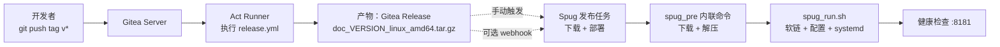

# Gitea Actions 发版 + Spug 上线

> 配合 [`release-gitea-actions.md`](../release/release-gitea-actions.md)。push tag 后 Actions 自动产出 Release 附件，Spug 拉取并部署。

## 适用场景

- 已经按 `release-gitea-actions.md` 配好 Gitea Actions Runner
- Spug 用于服务器上线编排
- 希望「打 tag → 自动构建 → Spug 一键发布」完全流水化

---

## 一、总链路



| 阶段 | 触发者 | 工件位置 |
|------|--------|----------|
| 构建 | Gitea Actions | `doc_<version>_linux_amd64.tar.gz` 在 Gitea Releases |
| 部署 | Spug（手动或 webhook） | 目标服务器 `/data/wwwroot/doc.itopcms.com` |
| 运行 | systemd | `doc.service` |

> 本方案与 [`deploy-spug-local.md`](./deploy-spug-local.md) 的服务器侧脚本完全一致，区别仅在发布包是 **Actions 产出** 而非 **开发者本机产出**。

---

## 二、前置条件

| 项目 | 要求 | 参考 |
|------|------|------|
| Actions 发版链路 | 已可正常 push tag 出 Release | [release-gitea-actions.md](../release/release-gitea-actions.md) |
| Spug 主机管理 | 已纳管目标服务器 | Spug 文档 |
| 服务器目录 | 已按约定建好 `WWW`、`REPO` | [deploy-spug-local.md](./deploy-spug-local.md#二服务器目录约定与现有-spug_runsh-一致) |
| Token | （私有仓库）Spug 应用密文中有 `GITEA_TOKEN` | 见下文 |

---

## 三、服务器目录与脚本（与本地方案共用）

直接复用：

- 目录约定：见 [deploy-spug-local.md 第二节](./deploy-spug-local.md#二服务器目录约定与现有-spug_runsh-一致)
- 前置脚本：见 [deploy-spug-local.md 第四节](./deploy-spug-local.md#四spug-前置脚本spug_presh)
- `deployments/spug/spug_run.sh`：仓库已有
- `deployments/systemd/doc.service`：仓库已有（调整建议见 [deploy-spug-local.md 第六节](./deploy-spug-local.md#六docservice-调整建议)）

> 两个方案的服务器侧逻辑相同，**前置脚本创建一份即可两种方案共用**。

---

## 四、与本地方案的关键差异

| 维度 | 本地脚本发版 | Actions 自动发版 |
|------|--------------|-----------------|
| 谁产出包 | 开发者本机 `release.{ps1\|bat\|sh}` | Gitea Actions Runner |
| 触发点 | 本机命令 | `git push origin refs/tags/v*` |
| Spug 发布触发 | 手动选 TAG | 手动选 TAG / webhook 自动触发 |
| 失败排查 | 本机日志 | Gitea Actions Run 日志 |
| 多人发版 | 需口头同步 | 谁 push tag 就由 Runner 跑 |

---

## 五、推荐 Spug 流水线

Spug 应用「Doc 文档系统」中新建发布配置：

### 1. 应用变量

| 变量 | 示例 | 说明 |
|------|------|------|
| `TAG` | `v1.0.0` | 必填，要部署的 Release tag（带 `v`） |
| `GITEA_OWNER` | `astrueus` | 仓库 owner |
| `GITEA_REPO` | `doc` | 仓库名 |
| `GITEA_URL` | `https://git.itopcms.com` | Gitea 站点 |
| `GITEA_TOKEN` | 密文 | 仅私有仓库需要 |

### 2. 发布步骤

只用一段「自定义命令」串起来即可：

```bash
set -euo pipefail

TAG="${TAG:?TAG 未设置，例如 v1.0.0}"
OWNER="${GITEA_OWNER:-astrueus}"
REPO="${GITEA_REPO:-doc}"
BASE="${GITEA_URL:-https://git.itopcms.com}"
TOKEN="${GITEA_TOKEN:-}"

WWW=/data/wwwroot/doc.itopcms.com
VERSION="${TAG#v}"
PKG="doc_${VERSION}_linux_amd64.tar.gz"
URL="$BASE/$OWNER/$REPO/releases/download/$TAG/$PKG"

echo "[1/4] 下载 $URL"
mkdir -p "$WWW"
CURL_OPTS=(-fL --retry 3 --retry-delay 2)
[ -n "$TOKEN" ] && CURL_OPTS+=(-H "Authorization: token $TOKEN")
curl "${CURL_OPTS[@]}" "$URL" -o "/tmp/$PKG"

echo "[2/4] 解压到 $WWW"
tar -xzf "/tmp/$PKG" -C "$WWW"
chmod 755 "$WWW/doc"

echo "[3/4] 二进制自检"
"$WWW/doc" version

echo "[4/4] 后置脚本"
export TAG
bash "$WWW/deployments/spug/spug_run.sh"
```

> 与 [`deploy-spug-local.md`](./deploy-spug-local.md#七spug-控制台配置示例) 中的「推荐：直接在 Spug 自定义命令里串成一条」一致，区别只在「包是谁产出」。

---

## 六、完整自动化路径（push tag 即生效）

### 方案 A：半自动（推荐起步）

```text
开发者：
  git tag -a v1.0.0 -m "..."
  git push origin refs/tags/v1.0.0

Gitea Actions：
  自动 build + 上传 Release（约 1~3 分钟）

运维 / 负责人：
  Spug 控制台 → 发布 → 选 TAG=v1.0.0 → 选目标主机 → 执行
```

优点：上线节奏可控；失败时可在 Spug 单独重试。

### 方案 B：全自动（Actions 直接通知 Spug）

`.gitea/workflows/release.yml` 在 release Job 末尾增加一步：

```yaml
      - name: Notify Spug
        if: success()
        env:
          SPUG_DEPLOY_URL: ${{ secrets.SPUG_DEPLOY_URL }}
          SPUG_TOKEN: ${{ secrets.SPUG_TOKEN }}
        run: |
          # Spug 提供「自定义发布触发接口」时使用；接口形式以你部署的 Spug 版本为准
          curl -fsS -X POST "$SPUG_DEPLOY_URL" \
            -H "Authorization: Bearer $SPUG_TOKEN" \
            -H "Content-Type: application/json" \
            -d "{\"app\": \"doc\", \"tag\": \"${GITHUB_REF_NAME}\"}"
```

需要在 Spug 上配置 webhook / API token，并在仓库 Secrets 添加 `SPUG_DEPLOY_URL`、`SPUG_TOKEN`。

> 全自动模式建议**仅用于测试环境**，生产环境保留人工审核更稳妥。

---

## 七、灰度发布

如果 Spug 已纳管多台主机，可分组上线：

1. 第一批：1 台 canary（`TAG=v1.0.0`）
2. 验证 5~10 分钟
3. 第二批：剩余主机

`spug_run.sh` 与 `doc.service` 不需要为灰度做修改。

---

## 八、回滚

与 [`deploy-spug-local.md` 第九节](./deploy-spug-local.md#九回滚) 完全一致：

- **方案 A**：Spug 发布旧 `TAG=v0.9.9`（下载旧 `doc_0.9.9_linux_amd64.tar.gz`）
- **方案 B**：用本地备份二进制（见本地方案 `spug_rollback.sh`）

> 不要主动删除旧 Release，否则无法靠方案 A 回滚。

---

## 九、与「本地脚本发版」并存

| 情形 | 推荐发版方式 |
|------|--------------|
| 日常 / 多人协作 | Actions（push tag 即可） |
| Runner 故障 / 紧急修复 | 临时切到本地脚本发版 |
| 实验性大改 | 本地脚本（`--dry-run` / 草稿，不污染生产 tag） |

服务器侧前置 + `spug_run.sh` 完全相同。

---

## 十、常见问题

### Q1：tag push 后 Actions 没触发
- Runner 未 Online；或 `runs-on` 标签不匹配
- 若 tag 是从 workflow 中创建并 push 的，默认 token 不会触发新 workflow，需用 PAT push

### Q2：Spug 拉包 404
- Release 未生成完成；等 Actions Run 结束再发布
- 附件文件名应为 `doc_<version>_linux_amd64.tar.gz`（`TAG=v1.0.0` → `doc_1.0.0_linux_amd64.tar.gz`），与 workflow 中产物一致

### Q3：解压后找不到 `WWW/doc`
- 检查 workflow 打包步骤是否把二进制放在包根并命名为 `doc`（见 [release-gitea-actions.md](../release/release-gitea-actions.md)）
- 旧文档里的 `dist/doc_linux_amd64` / `doc_linux_amd64.zip` 已废弃

### Q4：Actions 跑通但 Spug 发布失败 / 服务起不来
- 看 `systemctl status doc.service` 与 `journalctl -u doc.service`
- 重点排查：`app.conf` DB 连接、`httpport` 占用、`uploads` 权限

### Q5：私有仓库的 Release 附件不能匿名下载
- Spug 必须带 `GITEA_TOKEN`（应用密文）

### Q6：想限制只有特定分支打的 tag 才发布

```yaml
  - name: Ensure tag from main
    run: |
      git fetch origin main
      if ! git merge-base --is-ancestor $GITHUB_SHA origin/main; then
        echo "tag 不在 main 链路上，拒绝发布"; exit 1
      fi
```

### Q7：想要 Actions 完成后自动通知群（钉钉/企微）

```yaml
  - name: Notify
    if: always()
    run: |
      curl -fsS -X POST "$WEBHOOK_URL" \
        -H "Content-Type: application/json" \
        -d "{\"msgtype\":\"text\",\"text\":{\"content\":\"Doc ${{ github.ref_name }} 构建 ${{ job.status }}\"}}"
    env:
      WEBHOOK_URL: ${{ secrets.NOTIFY_WEBHOOK }}
```

---

## 十一、上线验证清单（与本地方案一致）

- [ ] Actions Run 状态 `success`
- [ ] Gitea Releases 页可下载 `doc_<version>_linux_amd64.tar.gz`
- [ ] Spug 发布日志最后输出「服务就绪」
- [ ] `systemctl is-active doc.service` = active
- [ ] `curl -fsS http://127.0.0.1:8181/` 返回 200
- [ ] `doc version` 输出 = TAG（去掉 `v`）
- [ ] `uploads` / `runtime` 仍为软链

---

## 十二、相关文档

- [release-gitea-actions.md](../release/release-gitea-actions.md)：Actions workflow 详解
- [release-local.md](../release/release-local.md)：本地脚本发版（Runner 故障时备选）
- [deploy-spug-local.md](./deploy-spug-local.md)：服务器侧脚本与目录约定（本文复用）
