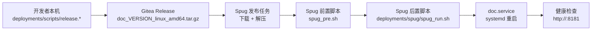

# 本地发版 + Spug 上线

> 配合 [`release-local.md`](../release/release-local.md)。本地脚本把发布包推到 Gitea Release，Spug 从 Gitea 拉取并部署到生产服务器。

## 适用场景

- 已经按 `release-local.md` 实现本地一键发版
- 服务器侧用 Spug 统一管理上线/回滚
- 不依赖 Gitea Actions Runner

---

## 一、总链路



| 节点 | 负责人 | 工件 |
|------|--------|------|
| 编译/发版 | 开发者本机 | `doc_<version>_linux_amd64.tar.gz` 上传到 Gitea Release（tag 为 `v<version>`） |
| 拉取/部署 | Spug | 把 tar.gz 解压到 `WWW` |
| 软链/服务 | `deployments/spug/spug_run.sh` | 持久化目录、`app.conf`、systemd |
| 运行 | `doc.service` | 启动根目录 `doc` |

---

## 二、服务器目录约定（与现有 `spug_run.sh` 一致）

```text
/data/wwwroot/doc.itopcms.com/         ← WWW：每次发布覆盖
  doc                                  ← 可执行文件（包根目录，已命名为 doc）
  conf/app.conf                        ← 每次从 REPO 覆盖
  conf/app.conf.example                ← 仓库自带
  conf/lang/                           ← 语言包
  web/static/  web/views/              ← 静态资源与模板（Round 2）
  uploads -> /data/repos/.../uploads   ← 软链
  runtime -> /data/repos/.../runtime   ← 软链
  deployments/
    spug/spug_pre.sh                   ← Spug 前置：下包、解压、自检
    spug/spug_run.sh                   ← Spug 后置：软链、app.conf、systemd
    systemd/doc.service                ← systemd unit 源文件

/data/repos/doc.itopcms.com/resource/  ← REPO：持久化数据，不随发布覆盖
  app.conf                             ← 权威配置（运维维护）
  uploads/                             ← 用户上传文件
  runtime/                             ← Beego 运行时（日志/缓存）
  scripts/
    doc.service                        ← systemd unit（由 spug_run.sh 从 deployments/systemd 同步）
  backup/<TAG>/                        ← 二进制备份（用于回滚）
```

> **核心约束**：`doc.service` 的 `ExecStart` 指向 `/data/wwwroot/doc.itopcms.com/doc`，因此必须保证 `WWW/doc` 始终是新版本可执行文件。

---

## 三、一次性准备（首次上线前手工执行）

在目标服务器 root 用户下：

```bash
# 1. 目录
mkdir -p /data/wwwroot/doc.itopcms.com
mkdir -p /data/repos/doc.itopcms.com/resource/{uploads,runtime,scripts,backup}

# 2. 准备初始 app.conf（首次部署 spug_run.sh 也会自动从 example 复制）
cp /path/to/app.conf.example /data/repos/doc.itopcms.com/resource/app.conf
vi /data/repos/doc.itopcms.com/resource/app.conf
# 至少修改：
#   httpport     = "8181"
#   db_adapter   = mysql 或 sqlite3
#   db_host/db_user/db_password/db_database
#   beegoserversessionkey（或环境变量 DOC_SESSION_KEY；example 无明文默认）
#   site_name / app_key 等

# 3. 必要工具（Linux 包为 tar.gz，不再依赖 unzip）
yum install -y curl tar   # 或 apt install -y curl tar
```

### Spug 端

1. 主机管理：纳管目标服务器，确保 SSH 可执行命令
2. 应用管理：新建应用「Doc 文档系统」
3. 配置中心（私有 Gitea 必做）：为该应用、**与发布配置相同的环境**增加 `GITEA_TOKEN`（PAT）
4. 发布配置：选 **自定义发布**（不要用「Git 仓库发布」去同步源码/二进制）

---

## 四、Spug 前置脚本：`deployments/spug/spug_pre.sh`

权威文件在仓库 [`deployments/spug/spug_pre.sh`](../../deployments/spug/spug_pre.sh)，随发布包解压到 `$WWW/deployments/spug/`。职责：

- 从 Gitea Release 下载 `doc_<version>_linux_amd64.tar.gz` 并解压到 `WWW`
- 包内二进制已在根目录名为 `doc`，不再从 `dist/` 拷贝
- `cd "$WWW"` 后再 `./doc version`（Spug 默认 cwd 是 `/tmp`，否则会去找 `/tmp/web/static/fonts` 并失败）
- 私有仓：配置中心的 `GITEA_TOKEN` **不会**自动变成环境变量；脚本用 `$SPUG_API_TOKEN` 去拉配置中心（`noPrefix=1`）

版本号只认自定义发布的 **`SPUG_RELEASE`**（申请单里填 `v2.3.0` 或 `2.3.0`）。不要换成 `SPUG_GIT_TAG`（那是常规发布、基于 Tag 才有值）。

可覆盖的变量：`TAG`、`GITEA_OWNER`、`GITEA_REPO`、`GITEA_URL`、`GITEA_TOKEN`、`SPUG_URL`（配置中心地址，默认 `https://spug.itopcms.com`）。

---

## 五、Spug 后置脚本：`deployments/spug/spug_run.sh`

仓库 [`deployments/spug/spug_run.sh`](../../deployments/spug/spug_run.sh) 每次发布会：

- 把 `uploads` / `runtime` 做成指向 `$REPO` 的**一层**软链（发布包空 `uploads/` 导致套娃时，先迁文件再改链）
- 用权威配置 `$REPO/app.conf` 覆盖 `$WWW/conf/app.conf`（改数据库只改 REPO 那份）
- 同步 systemd unit 并重启 `doc.service`

### 可选增强（未写入仓库脚本）

```bash
# 顶部：并发锁，防止 Spug 同时触发多次发布
LOCK=/var/lock/doc-deploy.lock
exec 9>"$LOCK"
flock -n 9 || { log "另一个发布任务进行中"; exit 1; }

# 末尾：版本备份 + 健康检查
TAG="${TAG:-unknown}"
mkdir -p "$REPO/backup/$TAG"
cp -f "$WWW/doc" "$REPO/backup/$TAG/doc" || true

# 健康检查：等待 systemd 拉起后端口可访问
PORT=$(grep -E '^httpport' "$WWW/conf/app.conf" | head -1 | sed -E 's/.*= *"?([0-9]+)"?.*/\1/')
PORT="${PORT:-8181}"

for i in 1 2 3 4 5 6 7 8 9 10; do
  sleep 2
  if curl -fsS "http://127.0.0.1:$PORT/" >/dev/null 2>&1; then
    log "服务就绪 :$PORT"
    log "当前版本: $(cd "$WWW" && ./doc version 2>&1 | head -1)"
    exit 0
  fi
  log "等待服务就绪 ($i/10)"
done

log "健康检查失败：journalctl -u $SERVICE_NAME --since '1 min ago'"
journalctl -u "$SERVICE_NAME" --since "1 min ago" | tail -50
exit 1
```

> 不修改仓库现有 `spug_run.sh` 也可工作；上述只是稳健性补强建议。

---

## 六、`doc.service` 调整建议

仓库 `deployments/systemd/doc.service` 默认 root 启动，且 `After=mysqld.service`。生产可调整：

```ini
[Unit]
Description=doc
After=network.target
# 仅当用 MySQL 且服务名为 mysqld 时启用：
# After=mysqld.service
# Wants=mysqld.service

[Service]
Type=simple
User=www
Group=www
WorkingDirectory=/data/wwwroot/doc.itopcms.com
ExecStart=/data/wwwroot/doc.itopcms.com/doc
Restart=always
RestartSec=3
# 可选：显式指定项目根（与 -dir 等效；未设置时默认用可执行文件所在目录）
# Environment=DOC_HOME=/data/wwwroot/doc.itopcms.com
# 若需要监听 < 1024 端口（默认 8181 不需要）：
# AmbientCapabilities=CAP_NET_BIND_SERVICE

LimitNOFILE=65535
NoNewPrivileges=true
PrivateTmp=yes

[Install]
WantedBy=multi-user.target
```

> 改为 `User=www` 后，需要把 `WWW` 与 `REPO` 目录 chown 为 www，并把 `spug_run.sh` 里的 `chown -R "$RUN_USER:$RUN_GROUP" ...` 那行注释打开。

---

## 七、Spug 控制台配置示例（自定义发布）

第 2 步「执行动作」三个按钮**不要全用**：

| 按钮 | 要不要加 | 原因 |
|------|----------|------|
| 添加本地执行动作 | **不要** | 那是在 Spug 服务器上编译/打包 |
| 添加数据传输动作 | **不要** | 那是把 Spug 工作区同步到目标机 |
| 添加目标主机执行动作 | **要，建议 2 条** | 目标机自己下 Gitea 包，再跑后置脚本 |

### 配置中心

| 变量 | 示例 | 说明 |
|------|------|------|
| `GITEA_TOKEN` | PAT | 私有仓下载附件；脚本经 API 拉取，不会自动变成 `$GITEA_TOKEN` |
| `GITEA_URL` / `GITEA_OWNER` / `GITEA_REPO` | 可省略 | 脚本有默认值 `https://git.itopcms.com` / `astrueus` / `doc` |
| `SPUG_URL` | `https://spug.itopcms.com` | 目标机访问配置中心用；与默认值相同可省略 |

必须绑在**这次发布所用的环境**（例如 `SPUG_ENV_KEY=node`）。

### 动作 1：目标主机 — 前置（首次必须内联）

首次 `$WWW` 里还没有 `spug_pre.sh`。把仓库 [`deployments/spug/spug_pre.sh`](../../deployments/spug/spug_pre.sh) **全文粘贴**到第一条「目标主机执行动作」。

第二次起包里已有文件，可改成：

```bash
bash /data/wwwroot/doc.itopcms.com/deployments/spug/spug_pre.sh
```

> 一直内联也可以，改脚本后记得同步更新控制台里的粘贴内容。

### 动作 2：目标主机 — 后置

```bash
export TAG="${TAG:-${SPUG_RELEASE:-}}"
bash /data/wwwroot/doc.itopcms.com/deployments/spug/spug_run.sh
```

这条在前置解压完成之后执行，文件一定已经在包里。

### 申请单

每次发布在 **环境变量（SPUG_RELEASE）** 填 `v2.3.0` 或 `2.3.0`（会自动补 `v`）。这就是 `$SPUG_RELEASE`，不是 Git Tag 选择器。

---

## 八、完整上线流程

```text
本机：
  deployments\scripts\release.bat 1.0.0 linux   # 或 ./deployments/scripts/release.sh 1.0.0 linux / just release 1.0.0
  # 产物：doc_1.0.0_linux_amd64.tar.gz，tag：v1.0.0

Spug：
  打开应用 → 新建自定义发布
  申请单 SPUG_RELEASE = v1.0.0（或 1.0.0）
  选目标主机 → 执行
  日志中观察：
    [spug-pre] TAG=v1.0.0 VERSION=1.0.0
    [spug-pre] 解压到 /data/wwwroot/doc.itopcms.com
    [spug-pre] 二进制自检
    Doc current version => 1.0.0
    [spug]    同步权威配置 .../app.conf -> .../conf/app.conf
    [spug]    软链 .../uploads -> .../resource/uploads
    [spug]    重新加载并重启 doc.service
    [spug]    部署完成。
```

---

## 九、回滚

### 方案 A：发布旧 tag（最简单）

```text
Spug 申请单 SPUG_RELEASE = v0.9.9 → 重新发布即可
```

`spug_pre.sh` 会下载 `doc_0.9.9_linux_amd64.tar.gz` 覆盖；`spug_run.sh` 重启服务；数据目录（`uploads`/`runtime`/`app.conf`）持久化不变。

### 方案 B：用本地备份的二进制（快速回退，但仅回退可执行文件）

`spug_rollback.sh`（手工执行）：

```bash
#!/bin/bash
set -euo pipefail
TAG="${1:?Usage: spug_rollback.sh <TAG>}"
WWW=/data/wwwroot/doc.itopcms.com
REPO=/data/repos/doc.itopcms.com/resource
BAK="$REPO/backup/$TAG/doc"

[ -f "$BAK" ] || { echo "no backup for $TAG"; exit 1; }

cp -f "$BAK" "$WWW/doc"
chmod 755 "$WWW/doc"
systemctl restart doc.service
echo "rolled back to $TAG"
cd "$WWW"
./doc version
```

执行：

```bash
bash /data/repos/doc.itopcms.com/resource/scripts/spug_rollback.sh v0.9.9
```

> 注意：方案 B 只回滚可执行文件；若新版本改动了 `web/`，需用方案 A 才能完整回退。

---

## 十、数据备份建议（首次上线就配上）

无论是否用 Spug，强烈建议每次发布前做一次数据快照（可写在 `spug_run.sh` 顶部或新建独立脚本）：

```bash
BAK_ROOT=/data/repos/doc.itopcms.com/resource/backup
SNAP="$BAK_ROOT/$(date +%Y%m%d_%H%M%S)_${TAG:-manual}"
mkdir -p "$SNAP"

# 1. 配置
cp -f /data/repos/doc.itopcms.com/resource/app.conf "$SNAP/" 2>/dev/null || true

# 2. SQLite
if [ -f /data/repos/doc.itopcms.com/resource/database.db ]; then
  cp -f /data/repos/doc.itopcms.com/resource/database.db "$SNAP/"
fi

# 3. MySQL（按需）
# mysqldump -h HOST -u USER -pPASS DB > "$SNAP/mindoc.sql"

# 4. 旧二进制
[ -f /data/wwwroot/doc.itopcms.com/doc ] && cp -f /data/wwwroot/doc.itopcms.com/doc "$SNAP/doc.prev"

# 5. 保留最近 10 份
ls -1dt "$BAK_ROOT"/*/ 2>/dev/null | tail -n +11 | xargs -r rm -rf
```

---

## 十一、常见问题

### Q1：`spug_run.sh` `chmod 755 "$WWW/doc"` 报「No such file」
- 前置脚本没跑 / 下载的不是当前格式的包
- 确认附件名为 `doc_<version>_linux_amd64.tar.gz`，解压后根目录有 `doc`

### Q2：systemd 报「指向 X 与本项目 Y 不一致」
- 服务器上之前手动装过 `doc.service` 指向别的路径
- 处理：`systemctl disable --now doc.service && rm /etc/systemd/system/doc.service`，再重新发布

### Q3：服务起来但端口不通
- `journalctl -u doc.service --since "5 min ago"`
- 检查 `app.conf` 的 `httpport` 与防火墙
- 检查 DB 连接

### Q4：用户上传文件丢失 / `uploads` 套娃
- 正确形态：`$WWW/uploads` **本身**是指向 `$REPO/uploads` 的软链
- 若 `ls -l` 看到 `uploads/` 是目录，里面还有一条 `uploads -> .../resource/uploads`，是发布包空目录导致 `ln -sfn` 套娃
- 当前 `spug_run.sh` 会把真实目录里的文件迁到 `$REPO/uploads`，再改成一层软链；下次发布自动处理

### Q5：app.conf 改了不生效
- 改的应该是 `$REPO/app.conf`（权威配置），不是 `$WWW/conf/app.conf`
- 每次发布 `spug_run.sh` 都会用 REPO 覆盖 WWW；改 REPO 后重新发布或手工 `cp -f` 再 `systemctl restart`

### Q6：私有仓库下载 401 / `GITEA_TOKEN` 拿不到
- 配在**配置中心**（且环境与本次发布一致），不要指望脚本里直接 `$GITEA_TOKEN` 有值
- `spug_pre.sh` 会用 `$SPUG_API_TOKEN` 调 `SPUG_URL/api/apis/config/?format=env&noPrefix=1`
- 目标机必须能访问 Spug 控制台地址（不要写 `127.0.0.1`）
- `set -u` 下不要写 `"$GITEA_TOKEN"` 或 `${#GITEA_TOKEN}`，用 `${GITEA_TOKEN-}` 赋给 `TOKEN`

### Q7：`GITEA_TOKEN: unbound variable`
- 脚本开了 `set -u`，变量未定义就会退出。以仓库 `spug_pre.sh` 为准，不要用旧的 `"$GITEA_TOKEN"` 写法

### Q8：`读取字体文件失败 ... /tmp/web/static/fonts`
- Spug 在 `/tmp` 里执行；必须 `cd "$WWW"` 再 `./doc version`，不要 `"$WWW/doc" version`
- `doc.service` 已有 `WorkingDirectory=`，systemd 启动不受这条影响

### Q9：`doc.service` 启动约 20ms 就失败
- `journalctl -u doc.service -n 80` 或 `cd "$WWW" && ./doc` 看真正报错
- 常见是 `$REPO/app.conf` 数据库配错；改 REPO 那份后再发布（脚本会覆盖到 WWW）

### Q10：Spug 显示成功但服务异常
- 当前 `spug_run.sh` 没做健康检查；可按第五节可选段追加 `curl` 自检

### Q11：仍按旧文档找 `doc_linux_amd64.zip` / `dist/doc_linux_amd64`
- 已废弃。以 [`release-local.md`](../release/release-local.md) 当前包约定为准：`doc_<version>_linux_amd64.tar.gz`，包内根目录 `doc`

### Q12：想把 `SPUG_RELEASE` 换成 `SPUG_GIT_TAG`
- 自定义发布里不要换。见上文第四节

---

## 十二、验证清单

每次上线后逐项过一遍：

- [ ] `systemctl is-active doc.service` 输出 `active`
- [ ] `curl -fsS http://127.0.0.1:8181/` 返回 200
- [ ] `cd /data/wwwroot/doc.itopcms.com && ./doc version` 与 SPUG_RELEASE（去掉 `v`）一致
- [ ] 浏览器登录后台，新建/查看文档正常
- [ ] `ls -l /data/wwwroot/doc.itopcms.com/uploads` 为软链
- [ ] `journalctl -u doc.service` 没有报错堆栈
- [ ] 备份目录 `$REPO/backup/<TAG>/` 已生成

---

## 十三、相关文档

- [release-local.md](../release/release-local.md)：本地发版脚本与包结构
- [deploy-spug-standard.md](./deploy-spug-standard.md)：改用常规发布以自动保留历史版本
- [deploy-spug-actions.md](./deploy-spug-actions.md)：如果改用 Gitea Actions 自动发版，再走 Spug 部署
