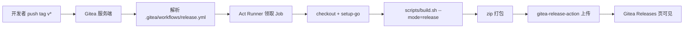

# Gitea Actions 自动发版

> push tag 后云端自动编译、打包、创建 Release、上传附件。需要先部署 Act Runner。

## 适用场景

- 已经有空闲的 Linux Runner 资源
- 发版频率较高，希望避免手工操作
- 团队多人参与发版

---

## 一、整体流程



---

## 二、前置条件

| 项目 | 要求 |
|------|------|
| Gitea 版本 | 1.19+（推荐 1.22+，Artifacts/Release 更完善） |
| Actions 开关 | 站点管理 → 配置 → Actions 已启用；仓库设置中 Actions 已勾选 |
| Runner | 至少一台 Act Runner，标签包含 `ubuntu-latest`（或自定义） |
| 网络 | Runner 能访问 Gitea API（公网或内网均可） |
| 工具链 | Runner 镜像或宿主机有 Go ≥ 1.25、`gcc`、`zip`；若交叉编译 Windows 需 Zig / MinGW-w64 |

---

## 三、Runner 安装与注册

### 1. 在 Gitea 管理后台生成 Runner 注册 Token

- 路径：站点管理 → Actions → Runners → New Runner（或仓库/组织级 Runner）
- 复制注册 Token

### 2. 部署 Runner（Docker 方式示例）

`docker-compose.yml`：

```yaml
version: "3.8"
services:
  runner:
    image: gitea/act_runner:latest
    container_name: doc-runner
    restart: always
    environment:
      - GITEA_INSTANCE_URL=https://git.itopcms.com
      - GITEA_RUNNER_REGISTRATION_TOKEN=<注册 Token>
      - GITEA_RUNNER_NAME=doc-runner-1
      - GITEA_RUNNER_LABELS=ubuntu-latest,doc
    volumes:
      - ./data:/data
      - /var/run/docker.sock:/var/run/docker.sock
```

启动：

```bash
docker compose up -d
```

### 3. 验证

- Gitea 管理后台 → Actions → Runners 出现该 Runner 为「Online」
- 后续 workflow 里 `runs-on:` 与 Runner 的 label 一致即可

### 4. （可选）自定义运行镜像

如果默认 `ubuntu-latest` 没有 Go 或 zip，可在 workflow 里 `setup-go` 安装；或自建带工具链的镜像，节省每次安装时间。

---

## 四、Secrets / 变量（可选）

默认 `${{ github.token }}` 已具备创建 Release 与上传附件权限，**无需额外配置**。

仅当出现以下情况才需要 PAT Secret：

| 场景 | 配置 |
|------|------|
| 跨仓库发布 | 仓库 → Settings → Secrets and Variables → `GITEA_TOKEN` |
| workflow 自己 push tag 触发其他 workflow | 必须用 PAT，默认 token 不会再触发新 workflow |
| 使用三方 Action（如 `akkuman/gitea-release-action`）需要显式 token | 同上 |

---

## 五、workflow 文件

新建 `.gitea/workflows/release.yml`：

```yaml
name: Release

on:
  push:
    tags:
      - 'v*'

permissions:
  contents: write

jobs:
  release:
    name: Build & Release
    runs-on: ubuntu-latest
    env:
      GOPRIVATE: git.itopcms.com
      GONOSUMDB: git.itopcms.com
    steps:
      - name: Checkout
        uses: actions/checkout@v4
        with:
          fetch-depth: 0

      - name: Setup Go
        uses: actions/setup-go@v5
        with:
          go-version: '1.25.0'
          cache: true

      - name: Install build deps
        run: |
          sudo apt-get update
          sudo apt-get install -y build-essential zip curl

      # 若需交叉编译 Windows，取消下面注释
      # - name: Install Zig
      #   run: |
      #     ZIG_VER=0.13.0
      #     curl -fL "https://ziglang.org/download/${ZIG_VER}/zig-linux-x86_64-${ZIG_VER}.tar.xz" -o /tmp/zig.tar.xz
      #     sudo tar -C /usr/local -xJf /tmp/zig.tar.xz
      #     sudo ln -sfn "/usr/local/zig-linux-x86_64-${ZIG_VER}/zig" /usr/local/bin/zig

      - name: Resolve version
        id: ver
        run: |
          # v1.0.0 -> 1.0.0
          VERSION="${GITHUB_REF_NAME#v}"
          echo "version=$VERSION" >> "$GITHUB_OUTPUT"
          echo "tag=$GITHUB_REF_NAME" >> "$GITHUB_OUTPUT"

      - name: Build (linux only by default)
        run: |
          chmod +x scripts/build.sh
          # 仅编 Linux；如需 all（同时出 Windows），需先安装 Zig
          ./scripts/build.sh --target=linux --mode=release --version="${{ steps.ver.outputs.version }}"

      - name: Verify binary
        run: |
          cp conf/app.conf.example conf/app.conf
          ./dist/doc_linux_amd64 version
          rm conf/app.conf

      - name: Package zip
        run: |
          zip -r doc_linux_amd64.zip \
            dist/doc_linux_amd64 \
            conf static views lib uploads favicon.ico LICENSE.md

      - name: Publish to Gitea Release
        uses: akkuman/gitea-release-action@v1
        env:
          NODE_OPTIONS: '--experimental-fetch'
        with:
          tag_name: ${{ steps.ver.outputs.tag }}
          name: Doc ${{ steps.ver.outputs.tag }}
          body: |
            Auto release ${{ steps.ver.outputs.tag }}
            - Linux amd64
          files: |
            doc_linux_amd64.zip
          sha256sum: true
```

---

## 六、可选：同时构建 Windows（matrix 并行）

`.gitea/workflows/release.yml`（多平台版）：

```yaml
name: Release

on:
  push:
    tags:
      - 'v*'

permissions:
  contents: write

jobs:
  build:
    name: Build ${{ matrix.target }}
    runs-on: ubuntu-latest
    strategy:
      matrix:
        target: [linux, windows]
    env:
      GOPRIVATE: git.itopcms.com
    steps:
      - uses: actions/checkout@v4
        with:
          fetch-depth: 0

      - uses: actions/setup-go@v5
        with:
          go-version: '1.25.0'

      - name: Install deps
        run: |
          sudo apt-get update
          sudo apt-get install -y build-essential zip
          if [ "${{ matrix.target }}" = "windows" ]; then
            sudo apt-get install -y mingw-w64
          fi

      - name: Build
        run: |
          chmod +x scripts/build.sh
          VERSION="${GITHUB_REF_NAME#v}"
          if [ "${{ matrix.target }}" = "windows" ]; then
            ./scripts/build.sh --target=windows --toolchain=mingw --mode=release --version="$VERSION"
          else
            ./scripts/build.sh --target=linux --mode=release --version="$VERSION"
          fi

      - name: Package
        run: |
          if [ "${{ matrix.target }}" = "windows" ]; then
            zip -r doc_windows_amd64.zip dist/doc_windows_amd64.exe conf static views lib uploads favicon.ico LICENSE.md
          else
            zip -r doc_linux_amd64.zip dist/doc_linux_amd64 conf static views lib uploads favicon.ico LICENSE.md
          fi

      - name: Upload artifact
        uses: actions/upload-artifact@v3
        with:
          name: pkg-${{ matrix.target }}
          path: doc_${{ matrix.target }}_amd64.zip
          retention-days: 1

  release:
    needs: build
    runs-on: ubuntu-latest
    permissions:
      contents: write
    steps:
      - uses: actions/download-artifact@v3
        with:
          path: pkgs

      - name: Flatten
        run: |
          mkdir -p out
          find pkgs -name '*.zip' -exec mv {} out/ \;
          ls -al out/

      - uses: akkuman/gitea-release-action@v1
        env:
          NODE_OPTIONS: '--experimental-fetch'
        with:
          tag_name: ${{ github.ref_name }}
          name: Doc ${{ github.ref_name }}
          files: |
            out/*.zip
          sha256sum: true
```

> 注意：Gitea 对 `actions/upload-artifact@v4` 在某些版本下有兼容问题。若 Gitea ≥ 1.22 且报 GHES 错误，可改用 `christopherhx/gitea-upload-artifact@v4`，或直接走单 Job 不用 artifact 中转。

---

## 七、私有依赖与 git 凭据

若 `go mod` 需访问私有 Gitea：

```yaml
      - name: Configure git for private modules
        run: |
          git config --global url."https://oauth2:${{ secrets.GITEA_TOKEN }}@git.itopcms.com/".insteadOf "https://git.itopcms.com/"
```

并在仓库 Secrets 里配置 `GITEA_TOKEN`（具备读权限即可）。

---

## 八、触发与回滚

### 触发

```bash
git tag -a v1.0.0 -m "Release v1.0.0"
git push origin v1.0.0
```

push tag 后立即在 Gitea Actions 列表看到 Run。

### 回滚某次发布

1. 删除远端 tag：
   ```bash
   git push origin :refs/tags/v1.0.0
   git tag -d v1.0.0
   ```
2. Gitea Releases 页面手动删 Release（API 也可，见 `release-local.md` 第八节）

---

## 九、版本号注入校验

workflow 内 `build.sh` 已通过 `-ldflags -X conf.VERSION=...` 注入。验证：

```bash
./dist/doc_linux_amd64 version
# 期望输出包含 1.0.0
```

如未注入，检查 `scripts/build.sh` 的 `LDFLAGS_COMMON` 和 `conf/enumerate.go` 中 `VERSION` 变量名是否一致。

---

## 十、常见问题

### Q1：Job pending 不动
- Runner 未在线，或 `runs-on` 标签不匹配
- 进 Gitea Actions → Runners 检查

### Q2：`actions/checkout` 失败 / 提示 GHES
- 用兼容版本：`actions/checkout@v4`
- 升级 Gitea 到 1.22+

### Q3：`go mod tidy` 拉私有模块 401
- 检查 git 凭据注入（第七节）
- `GOPRIVATE` 是否覆盖到 `git.itopcms.com`

### Q4：发版触发条件想加分支限制
```yaml
on:
  push:
    tags:
      - 'v*'
    branches:
      - main   # tag 必须从 main 打出来才能触发，可结合自定义脚本判定
```
> Gitea 对组合触发的支持依版本而异，必要时在 job 起始用 `if` 校验。

### Q5：想增加 changelog
- 引入 `git-cliff` 或 `conventional-changelog`
- 在 workflow 里生成 `CHANGELOG.md`，再传给 `body_path`

```yaml
      - name: Generate changelog
        run: |
          # 简化示例：取从上一个 tag 到当前的提交
          PREV=$(git describe --tags --abbrev=0 HEAD^ 2>/dev/null || echo "")
          if [ -n "$PREV" ]; then
            git log --pretty=format:'- %s (%h)' "${PREV}..HEAD" > CHANGELOG.md
          else
            git log --pretty=format:'- %s (%h)' > CHANGELOG.md
          fi

      - uses: akkuman/gitea-release-action@v1
        with:
          tag_name: ${{ github.ref_name }}
          body_path: CHANGELOG.md
          files: |
            doc_linux_amd64.zip
```

### Q6：Runner 磁盘膨胀
- 定期清理：`docker system prune -af`
- `act_runner` 容器加 `tmpfs` 挂载 `/tmp`

---

## 十一、与 Spug 协同

Actions 把 zip 发布到 Gitea Release 后，Spug 拉取并部署到目标服务器。详见 [`deploy-spug-actions.md`](./deploy-spug-actions.md)。

---

## 十二、最小落地步骤

```text
1. 部署 Act Runner，确认 Online
2. 在仓库根目录新建 .gitea/workflows/release.yml（拷贝本文「单 Job 版」）
3. 提交 push 到主分支
4. 本地打 tag 并 push：
     git tag -a v1.0.0 -m "Release v1.0.0"
     git push origin v1.0.0
5. Gitea Actions 页面观察 Run
6. Releases 页面看到 v1.0.0 与 doc_linux_amd64.zip
```
